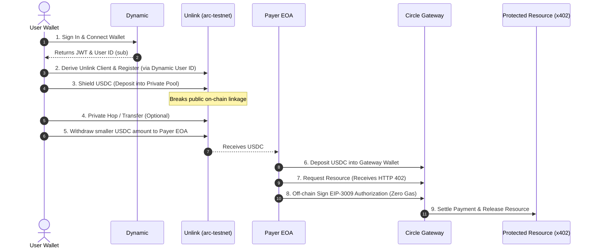

# Web3 Stack Integration Research: Dynamic + Unlink + Circle Gateway (Arc Testnet)

This document outlines the technical architecture, SDK APIs, and integration workflows for incorporating **Dynamic**, **Unlink**, and **Circle Gateway / Arc Testnet** into our hackathon project. 

---

## 1. Executive Summary: The Private Nanopayment Flow

A high-performance project integrating these three protocols enables **privacy-preserving nanopayments** (sub-cent, gas-free payments) for APIs/resources on the USDC-native **Arc L1 chain** without exposing the user's funding wallet address. 



---

## 2. Service-by-Service Integration Guides

### A. Dynamic (Identity & Authentication)
Dynamic is used to authenticate users, connect external wallets (EVM, Solana, etc.), and provide the secure context.
* **NPM Package**: `@dynamic-labs/sdk-react-core` and `@dynamic-labs/ethereum` (or `@dynamic-labs/viem`).
* **Session Identifier**: The `sub` field (user ID) in the Dynamic session JWT is used as the `userId` anchor in Unlink's ZK database.

#### React Context Provider Setup:
```tsx
import { DynamicContextProvider } from '@dynamic-labs/sdk-react-core';
import { EthereumWalletConnectors } from '@dynamic-labs/ethereum';

export default function RootLayout({ children }: { children: React.ReactNode }) {
  return (
    <DynamicContextProvider
      settings={{
        environmentId: process.env.NEXT_PUBLIC_DYNAMIC_ENV_ID || 'sandbox-env-id',
        walletConnectors: [EthereumWalletConnectors],
      }}
    >
      {children}
    </DynamicContextProvider>
  );
}
```

#### Hook Integration:
```tsx
import { useDynamicContext } from '@dynamic-labs/sdk-react-core';

export function LoginControl() {
  const { user, primaryWallet, handleLogOut, sdkHasLoaded } = useDynamicContext();

  if (!sdkHasLoaded) return <div>Initializing...</div>;
  if (!user) return <button onClick={() => {/* trigger widget */}}>Connect</button>;

  return (
    <div>
      <span>Operator: {user.email || user.username}</span>
      <span>Address: {primaryWallet?.address}</span>
    </div>
  );
}
```

---

### B. Unlink (Zero-Knowledge Privacy Layer)
Unlink breaks the on-chain link between the funding wallet and the transaction. It runs as a smart contract layer on EVM chains, including Circle's new L1, **Arc**.
* **NPM Packages**: `@unlink-xyz/sdk`
  * `@unlink-xyz/sdk/browser` (Client-side ZK-proof generation)
  * `@unlink-xyz/sdk/admin` (Backend admin/custodial API key control)
  * `@unlink-xyz/sdk/crypto` (Derivations)
* **SDK Environment**: `arc-testnet` (for Arc L1 testnet).

#### Client Initialization and Registration:
```ts
import { account, createUnlinkClient } from "@unlink-xyz/sdk/browser";

// Derive Unlink seed from wallet signature to avoid exposing plain mnemonics
const unlinkAccount = account.fromMetaMask({
  provider: window.ethereum,
  appId: "alchm-hack-station",
  chainId: 84532, // or Arc Testnet chain ID
});

const client = createUnlinkClient({
  environment: "arc-testnet",
  account: unlinkAccount,
  userId: dynamicUserSubId, // Bind to Dynamic User ID
});

// Cache registration and verify account
await client.ensureRegistered();
```

#### Balance & Funding:
```ts
// Faucet funding for testnet USDC
await client.faucet.requestPrivateTokens({ token: ARC_USDC_ADDRESS });

// Fetch balances
const { balances } = await client.getBalances();
console.log("Private balances:", balances);
```

#### ZK Transfer & Private Withdrawal:
```ts
// 1. ZK Transfer to another Unlink address (breaks link further)
const transferTx = await client.transfer({
  recipientAddress: "unlink1recipientAddress...",
  token: ARC_USDC_ADDRESS,
  amount: "1000000", // 1 USDC in base units (6 decimals)
});
await transferTx.wait();

// 2. Withdraw privately to a separate EOA (to pay for resources)
const withdrawTx = await client.withdraw({
  recipientEvmAddress: payerEoaAddress,
  token: ARC_USDC_ADDRESS,
  amount: "2000000", // 2 USDC in base units
});
await withdrawTx.wait();
```

---

### C. Circle Gateway & Arc L1 (USDC-Native Settling & Gasless Nanopayments)
Arc L1 uses USDC as its native gas token, ensuring deterministic dollar-denominated fees. Circle Gateway enables sub-cent payments via HTTP 402 header negotiation and EIP-3009 off-chain signatures.
* **NPM Package**: `@circle-fin/x402-batching`
* **Chain Name**: `arcTestnet`

#### Paying for Resources (Client-Side Buyer):
```ts
import { GatewayClient } from "@circle-fin/x402-batching/client";

// Initialize client with the withdrawn EOA wallet keys
const gateway = new GatewayClient({
  chain: "arcTestnet",
  privateKey: payerPrivateKey, // Withdrawn EOA key (private from funding wallet)
  rpcUrl: "https://rpc.testnet.arc.io", // Arc L1 Node
});

// Deposit funds into the Gateway Wallet contract
await gateway.deposit("1.99"); // 1.99 USDC (decimal format)

// Pay for the protected resource URL (handles 402 negotiation automatically)
const response = await gateway.pay("https://seller-api.xyz/v1/premium-resource");
const data = await response.json();
```

---

## 3. Privacy & Security Best Practices (Crucial for Hackathon Success)

1. **Amount Correlation**: Avoid depositing 10.0 USDC and immediately withdrawing 10.0 USDC to your payer EOA. Timing and size correlation allow observers to link the addresses. Maintain a larger private buffer and withdraw in smaller, asymmetric portions over time.
2. **Key Protection**: Plain text seeds or KEKs (Key Encryption Keys) should never leave the client or be sent to Unlink's servers. Encryption keys for user-stored mnemonic envelopes must be derived locally (using PBKDF2/scrypt, or WebAuthn PRF) and never derived from simple IDs or JWT fields.
3. **Payer EOA Nature**: The payer EOA for Circle Gateway must be a simple external owned account (EOA). Do not use smart accounts or direct contract execution.

---

## 4. Quick Config & Hackathon Setup Checklist

- [ ] **Dynamic Dashboard**: Set up a sandbox at [app.dynamic.xyz](https://app.dynamic.xyz/). Go to **Chains and Networks** and enable the EVM-compatible **Arc Testnet** configuration.
- [ ] **Unlink API Key**: Obtain a testnet API key for `arc-testnet` to authorize register/auth routes on our backend.
- [ ] **Circle Faucet**: Request testnet USDC for your wallet from the [Circle Faucet](https://faucet.circle.com/) targeting Arc Testnet to seed gas.
- [ ] **Gateway Client RPC**: Configure a stable RPC endpoint for Arc Testnet (`https://rpc.testnet.arc.io`) in our environment variables.
