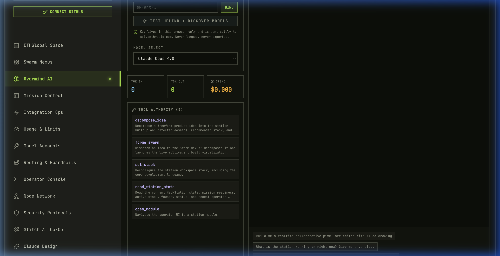
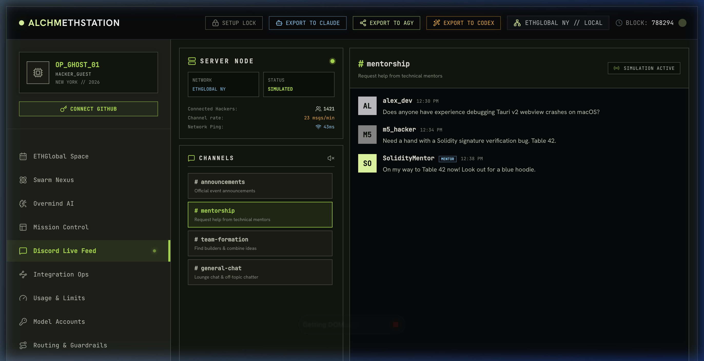
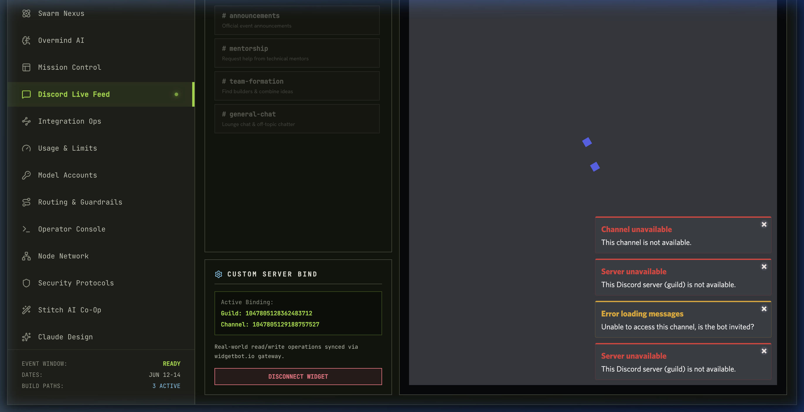

# Walkthrough: Plan Customizer, Discord Live Feed & Private Nanopayments

This walkthrough summarizes the implementation and verification of:
1. **Interactive Plan Customizer**: Selecting custom programming languages, styling libraries, frameworks, database drivers, and AI/LLM models to customize and re-forge build plans.
2. **Dynamic Task Management**: The ability to add, edit, and delete tasks within the Swarm Nexus (Crucible) simulation.
3. **Discord Event feed**: A live ETHGlobal event feed with simulated message rooms (`#announcements`, `#mentorship`, `#team-formation`, and `#general-chat`) and a widget settings form to connect a real Discord server via a WidgetBot iframe.
4. **Private Nanopayments**: An interactive dashboard showing step-by-step integrations with Dynamic (Web3 Auth), Unlink (ZK private pool shielding & timing obfuscation withdrawals), and Circle Gateway (x402 protocol micro-payment settlement on Arc testnet).

---

## Changes Made

### 1. Swarm Plan Generation & Override
* **Modified** `src/lib/swarmEngine.ts`: Updated [decomposeIdea](../src/lib/swarmEngine.ts#L602) to accept an optional `overrideLanguageId` parameter. If set, this forces the primary language stack value and re-sequences the simulated task graph to align with the chosen technology.
* **Modified** `src/components/SwarmNexus.tsx`: Replaced static technology chips with interactive dropdown-based selectors for Language, Styling, Framework, Database, and LLM Model. Changes to language auto-regenerate the plan.

### 2. Inline Task CRUD (Create, Read, Update, Delete)
* **Modified** `src/components/SwarmNexus.tsx`: Added form state and action handlers:
  * **Add Task**: Inline input to specify task title, role (Architect, Builder, Designer, Sentinel, Herald, Captain), phase (Plan, Build, Verify, Ship), and complexity.
  * **Delete Task**: Clicking a task card's delete icon removes it and automatically recalculates dependencies.
  * **Edit Task**: Clicking a task card's edit button switches it into an inline edit form to modify title, assignee role, phase, and complexity.

### 3. Discord Feed & Widget Bindings
* **Created** [DiscordLiveFeed.tsx](../src/components/DiscordLiveFeed.tsx): Contains a split-screen dashboard:
  * **Left Side**: Navigation for 4 channels (`#announcements`, `#mentorship`, `#team-formation`, `#general-chat`), live channel telemetry (connected hackers, active pings, message rate), sound chime settings, and custom Guild/Channel binding form.
  * **Right Side**: Real-time simulated message feed with smart auto-replying based on context. If a user connects a custom guild/channel, it mounts a `widgetbot.io` iframe for real-world Discord interaction.
* **Modified** [SidebarDrawer.tsx](../src/components/SidebarDrawer.tsx): Mounted the Discord icon and route.
* **Modified** [App.tsx](../src/App.tsx): Added the `DiscordLiveFeed` panel.

### 4. Private Nanopayments Integration Module
* **Created** [PrivateNanopayments.tsx](../src/components/PrivateNanopayments.tsx): A complete interactive multi-step control panel showcasing:
  * **Config Panel**: Configurable environment settings including `Dynamic Env ID`, `Unlink API Key`, and `RPC Endpoint`.
  * **Step 1 (Dynamic)**: Embedded wallet connection and session JWT verification.
  * **Step 2 (Unlink)**: On-chain identity seeding, testnet USDC faucet requests, and ZK-shielding to pool funds.
  * **Step 3 (Obfuscation)**: Derivation of fresh single-use Payer EOAs and timing-independent withdrawals (severing the transaction correlation link).
  * **Step 4 (Circle x402)**: Micro-deposits to Circle Gateway and off-chain EIP-3009 signature negotiations to unlock protected premium API content.
  * **Telemetry Terminal**: Stream of cryptographic execution details (BN254 curve, Groth16 proofs, EIP-3009 transfer parameters, transaction hashes, gas metrics).
* **Modified** [SidebarDrawer.tsx](../src/components/SidebarDrawer.tsx): Added the `ShieldCheck` icon and `private-nanopayments` item.
* **Modified** [App.tsx](../src/App.tsx): Mounted the `PrivateNanopayments` panel when active tab is `private-nanopayments`.

---

## Verification Results

### 1. Automated Verification
* The application builds successfully via Vite with no TS errors. Checked via `bun run build` in the workspace.

### 2. Manual Visual Verification
Visual validations were performed via browser subagents to ensure responsive styling, fluid state updates, and proper interactive flows.

````carousel

<!-- slide -->

<!-- slide -->

````

### Browser Recording Demos
The following animated recordings showcase browser subagent actions validating the interactive customizer dropdowns, inline edits, and Discord integrations:


*Demo: Selecting different languages in the stack dropdown, checking the simulated Discord channels, adding custom tasks, and connecting the real Discord WidgetBot iframe.*


*Demo: Editing task titles inline, deleting tasks, verifying simulated task completion pulses, and observing auto-resolved dependencies.*
