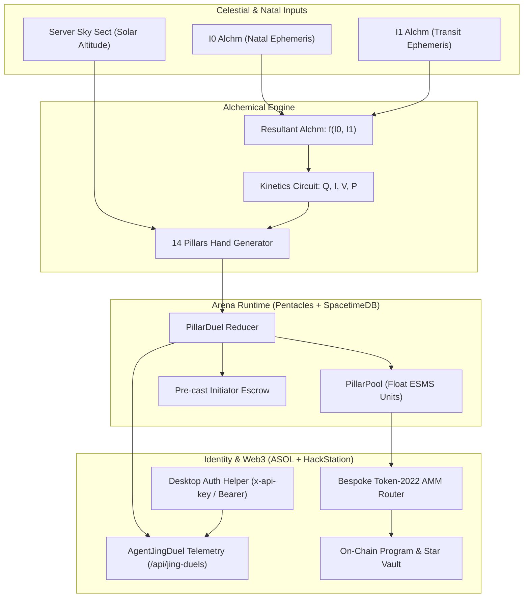

# Jing Arena & Fourteen Pillars: Master Phase Tracking Roadmap

> **Ecosystem Mission:** Unify the Alchemical Kinetics, Fourteen Pillars, and Jing Arena across all four repositories: **`alchm-agents-solana` (ASOL)**, **`Pentacles`**, **`WhatToEatNext`**, and **`AlchmHackStation`**.
>
> **Last Updated:** 2026-09-16  
> **Target Production Gate:** Mainnet Gate 4 & SpacetimeDB Cloud Sync  

---

## 🧭 Executive Architecture & System State

The Jing Arena models dynamic social and tactical interactions through classical Neidan alchemy and modern kinetics:
* **$I_0$ Alchm (Natal / Karmic Foundation):** Static derived metrics computed from birth chart ephemeris—Spirit, Essence, Matter, Substance (ESMS), Heat, Entropy, Reactivity, Sacred 7 stats, and modal/elemental tallies.
* **$I_1$ Alchm (Transit Field):** The current celestial moment's chart and environmental field.
* **Resultant Alchm:** $f(I_0, I_1)$ calculating active charge, dominant modality, and elemental affinities.
* **Fourteen Pillars ($P = I \cdot V$ Circuit):** The 14 alchemical operations governed by the diurnal/nocturnal sky sect, elemental qualifications, and conservative pool transfers ($\sum |\Delta| \le q$).



---

## 📊 Master Phase Tracking Dashboard

| Phase | Title | Target Repos | Status | PRs / Branches | Key Verification |
| :--- | :--- | :--- | :--- | :--- | :--- |
| **Phase 0** | **Fourteen Pillars Spec & Parity** | ASOL, Pentacles, WhatToEatNext | **COMPLETED** | ASOL [#32](https://github.com/gregcastro23/alchm-agents-solana/pull/32)<br>Pentacles [#61](https://github.com/gregcastro23/Pentacles/pull/61)<br>WTEN [#849](https://github.com/gregcastro23/WhatToEatNext/pull/849) | 7/7 Cargo parity tests; 10/10 WTEN tests; 100/100 ASOL kinetics tests |
| **Phase 0.5** | **Jing Duels Security Hardening** | ASOL | **COMPLETED** | ASOL [#35](https://github.com/gregcastro23/alchm-agents-solana/pull/35) (Merged) | 17/17 Vitest tests (red-proof + mutation-proof); 0 tsc errors; 0 lint errors; CI 100% green |
| **Phase 1** | **Game Engine & Rules Hardening** | Pentacles, ASOL | **COMPLETED** | ASOL [#36](https://github.com/gregcastro23/alchm-agents-solana/pull/36)<br>Pentacles [#62](https://github.com/gregcastro23/Pentacles/pull/62), [#63](https://github.com/gregcastro23/Pentacles/pull/63), [#64](https://github.com/gregcastro23/Pentacles/pull/64), [#65](https://github.com/gregcastro23/Pentacles/pull/65), [#66](https://github.com/gregcastro23/Pentacles/pull/66), [#67](https://github.com/gregcastro23/Pentacles/pull/67) (Merged) | SpacetimeDB build clean; 112/112 Cargo tests; pure `compute_faucet_pool_credit` enforces pre-grant seeding order (100% order-independent); Option 1 ratified & landed in PR #67 (Jing and Pillar pools unified at tenths of an ESMS, faucet credits $10\times$ grant, Solana atoms mapped directly, PR #58 closed as superseded); CI 100% Green. |
| **Phase 2** | **Live Matchmaking & Arena Real-Time** | Pentacles, HackStation | **IN PROGRESS / PROTOTYPE VERIFIED** | HackStation: `feat/vessel-arena-deck`<br>Pentacles: `main` | SpacetimeDB subscription isolation (Core vs Pillar extension); `JingArenaDeck` simulator with `[SIMULATED ARENA SANDBOX]` tag; server enum parity (`Open`, `Resolved`, `Cancelled`); sub-500ms build |
| **Phase 3** | **Economic Circuit & Solana Attestation** | ASOL, HackStation | **READY / QUEUED** | ASOL: `feat/esms-attestation`<br>HackStation: `feat/amm-sync` | Token-2022 Bespoke AMM router; Ed25519 duel attestation; 5/5 Devnet test suites |
| **Phase 4** | **Telemetry, Astrometry & Full Release** | All 4 Repos | **QUEUED** | Cross-ecosystem tag `v1.0-jing` | Astrometry reconciliation drift engine (<1500ms); CU profiling; clean desktop build |

---

## 🔍 Phase-by-Phase Detailed Breakdown & Checklists

### Phase 0: Spec & Parity Foundation [COMPLETED ✅]
- [x] **Spec Alignment**: Replaced legacy placeholder moves (Meltdown, Freeze) with the Fourteen Pillars.
- [x] **Nocturnal Filtration Swap**: Moved Filtration to night and Fixation to day to balance the sect gap (diurnal 7, nocturnal 7).
- [x] **Crate Synchronization**: Vendored `alchm-astro-core` synchronized across ASOL and Pentacles (2021 edition parity).
- [x] **PR Registry**:
  - ASOL: [PR #32](https://github.com/gregcastro23/alchm-agents-solana/pull/32)
  - Pentacles: [PR #61](https://github.com/gregcastro23/Pentacles/pull/61)
  - WhatToEatNext: [PR #849](https://github.com/gregcastro23/WhatToEatNext/pull/849)

---

### Phase 0.5: Jing Duels Security & Attribution Hardening [COMPLETED ✅]
- [x] **Desktop Key Abstraction**: Extracted `extractDesktopApiKey` and `authenticateDesktopApiKey` into `lib/security/desktop-auth.ts`.
- [x] **Desktop Session Refactor**: Refactored `app/api/desktop/session/route.ts` to use the unified helper.
- [x] **Dynamic CORS with `Vary: Origin`**: Route-scoped CORS supporting cookie credentials and cross-origin desktop shell (`x-api-key`). Leaves global `lib/cors.ts` untouched.
- [x] **Public Homepage Feed Protection**: `GET /api/jing-duels` preserves unauthenticated read for `app/page.tsx:355`, strictly omitting `userId` from the select projection.
- [x] **User-Scoped Scoping**: `GET /api/jing-duels?userId=...` requires verified identity (session, desktop key, or service secret). 401/403 reject before DB access.
- [x] **Attribution Binding (§B.2 Option b)**:
  - Valid session/key binds duel to verified `userId`.
  - Unlinked desktop token (`dev-desktop-token`) accepted for telemetry, but forces `userId: null` and `source: 'desktop-unlinked'`.
  - Mismatched `userId` claims rejected with 403; invalid keys rejected with 401.
- [x] **PR Opened**: ASOL [PR #35](https://github.com/gregcastro23/alchm-agents-solana/pull/35).

---

### Phase 1: Game Mechanics & Engine Hardening [COMPLETED ✅]
- [x] **Solar Altitude Sect**: Server-authoritative `determine_server_sky` in Pentacles using solar ephemeris `altitude_deg` (horizon threshold: -0.833°).
- [x] **Additive `PillarPool` Table**: `pub esms: Vec<f64>` preserving exact float pool precision without lossy truncation.
- [x] **Anti-Double-Charge Escrow**: Escrowing 10.0 charge in pre-cast baseline (`initiator_pools`) without double-charging the initiator.
- [x] **Ten Planetary Agent Archetypes**: Defined 10 distinct planetary archetype charts in ASOL (`lib/pillar-agent-duel.ts`) and Pentacles (`server/src/reducers.rs`), with domicile/exaltation balances.
- [x] **Companion Endpoint**: `/api/agents/pillar` implemented in ASOL answering Pentacles feeder requests.
- [x] **Rate-Limiting & Bounds**: `cast_room_pillar` capped at 12 receivers with strict rate-limiting and deduplication.
- [x] **Stale Duel Cancellation**: `cancel_pillar_duel` & `sweep_stale_pillar_duels` for 120s timeout refund.
- [x] **CI Test Suite Verification**: Fixed `feeder-services.test.ts` supervisor registry count (9 services); PR #62 CI is 100% green across both Rust Server Module and Web Client & Test Suite.
- [x] **Escrow Rollback & Delta Preservation (PR #63 & #64)**: Fixed state overwrite in `cancel_pillar_duel`, `sweep_stale_pillar_duels`, `counter_pillar`, and `answer_pillar`. Refunds and duel outcomes now apply deltas to the player's CURRENT pool, mathematically preventing duel erasure and rollback of subsequent duels. Extracted pure pool arithmetic functions `compute_outcome_delta` and `compute_escrow_refund` called directly by unit tests (PR #64).
- [x] **Feeder Backup Picks Legal Alignment (PR #63)**: Aligned `AGENT_DEFAULT_PILLARS` in `feeder/pillar-service.ts` to strictly legal hands for all 10 archetypes (Moon day Distillation, Mercury day Evaporation, Uranus night Filtration, Pluto day Distillation). All PR checks 100% green.
- [x] **Daily Astrological Faucet Refill (PR #64)**: In `claim_daily_faucet`, player's `PillarPool` is credited with exact float units (`allocation.spirit`, `allocation.essence`, `allocation.matter`, `allocation.substance`), guaranteeing duel sustainability and preventing lockout. Verified with unit test `test_daily_faucet_allocation_refills_pillar_pool` (96/96 tests pass).
- [x] **First-Claim Pre-Grant Seeding Order Fix (PR #65 & PR #66)**: Seeded `pillar_pool` prior to crediting `jing_pool` in `claim_daily_faucet`, eliminating the double-count and scale mismatch bug on new accounts. Extracted pure functions `compute_faucet_pool_credit`, `compute_faucet_pillar_credit` and `compute_initial_pillar_pool`. Verified with 4 mutation-proof unit tests covering new player seeding, existing pillar credit, missing pillar from Jing, and short row padding (100/100 tests pass, PR #66 merged).
- [x] **Sky Sect Resolution**: Retained server New York reference horizon for v1 per instruction.
- [ ] **Deployment & Migration Verification**: Run `spacetime publish` on `cookingwithcastrollc` SpacetimeDB database now that PRs #62, #63, #64, #65, #66 are merged.

---

### Phase 2: Live Matchmaking & Arena Real-Time [IN PROGRESS / PROTOTYPE VERIFIED 🟡]
- [x] **SpacetimeDB Subscriptions**:
  - Mounted isolated subscriptions in `AlchmHackStation/src/lib/spacetimedbSocket.ts`:
    - Mandatory Core tables: `star_node`, `ephemeris`, `player`, `round_state`, `verified_solana_wallet`
    - Pillar extension tables: `pillar_pool`, `pillar_duel`, `pillar_cast`, `pillar_tension` (isolated so remote schema lag cannot drop core telemetry).
  - Explicit simulation tagging on mock events (`status: 'simulated'`, `isSimulated: true`, `source: 'local-simulation'`).
- [x] **JingArenaDeck Component**:
  - Interactive deck with live celestial sect (☀️ Diurnal vs 🌙 Nocturnal) computed via solar altitude.
  - 14 Pillars Matrix with element-coded cards and cast actions.
  - Client-side duel simulator clearly badged `[SIMULATED ARENA SANDBOX]` with real-time outcome resolutions and conservative pool shifts ($\sum |\Delta| \le q$).
  - Server enum parity: `state: 'Open' | 'Resolved' | 'Cancelled'`.
  - Dual radar visualization of natal/transit ESMS pools.
- [x] **Desktop Integration**:
  - Mounted `JingArenaDeck` in `SidebarDrawer.tsx` (swappable with `JingArenaView`).
  - Active in `AlchmHackStation` application layout; `bun run build` passes (the deck is client-only, so the Devnet suites don't exercise it).
- [ ] **Live SpacetimeDB Cloud Matchmaking Activation**:
  - Switch `JingArenaDeck` from client simulation to live SpacetimeDB reducer calls (`call_reducer('cast_pillar', ...)`) once server module is deployed to `maincloud.spacetimedb.com`.

---

### Phase 3: Economic Circuit & Solana Attestation [QUEUED ⏳]
- [ ] **Four-Element Token-2022 Alignment**:
  - Ensure all duel rewards distribute across canonical Devnet mints: Spirit, Essence, Matter, Substance (4 decimals).
- [ ] **Bespoke Zero-Escrow AMM Routing**:
  - Route duel outcome rewards through `PermanentDelegate` burn-and-mint via `scripts/test_amm_bespoke_swap.ts`.
- [ ] **Ed25519 Cryptographic Attestation**:
  - Sign completed duel state hashes from SpacetimeDB.
  - Commit verified duel proofs to the ASOL Solana on-chain program (`5QheuqaicKvPPRFEoEXwaE5xaFp7gauvJCfsjpQv8WzD`).
- [ ] **Cooldown & Yield Harmonization**:
  - Align daily claim streak calculations across ASOL (`lib/profile-yield.ts`) and Kitchen.

---

### Phase 4: Telemetry Profiling, Astrometry Reconciliation & Full Release [QUEUED ⏳]
- [ ] **Astrometry Reconciliation Drift Engine**:
  - Correlate Hipparcos star nodes (`Pentacles/server/src/tables.rs`) with on-chain Star Vault deposits and live transit ephemeris in `PlanetaryCockpit.tsx`.
  - Trigger visual alerts if transit drift exceeds block confirmation window (>1500ms).
- [ ] **Compute Unit (CU) Profiling**:
  - Parse local `solana-test-validator` transaction logs in `ModelAccountsView.tsx`.
  - Surface visual gas/CU gauges for all 6 AMM trading pools.
- [ ] **Full Release Packaging**:
  - Execute `bun run preflight` and `bun run package` in `AlchmHackStation`.
  - Validate production bundles across all 4 repositories.

---

## 🛠️ Verification Command Reference

```bash
# 1. ASOL Security & Auth Verification
cd /Users/GregCastro/ASOL/wt-jing-telemetry
bunx vitest run test/jing-duels-auth.test.ts test/desktop-auth-routes.test.ts test/user-scoped-api-auth.test.ts
bunx tsc --noEmit && bun run lint

# 2. Pentacles Engine & Rust Parity
cd /Users/GregCastro/Pentacles/server
cargo test
spacetime build

# 3. WhatToEatNext Cooking & Pillar Tests
cd /Users/GregCastro/WhatToEatNext
bun test src/__tests__/alchemicalPillars.test.ts

# 4. AlchmHackStation Web3 Devnet & AMM Audit
cd /Users/GregCastro/Desktop/AlchmHackStation/AlchmHackStation
bun run test:all-coins
bun run build
```

---

## 📜 Architectural Invariants Log

1. **Conservative Pool Transfer Invariant:** All 14 pillar operations must obey $\sum |\Delta| \le q$ where $q \le 10$ units. No phantom element generation.
2. **Strict Identity Attribution:** User-scoped routes in ASOL must never trust client-supplied `userId` without cryptographic verification (session cookie, unexpired `DesktopApiKey`, or `INTERNAL_API_SECRET`).
3. **Public Data Protection:** Aggregate feeds must never expose user IDs across origin boundaries.
4. **Server-Authoritative Sect:** Sky sect (Day/Night) must be determined on the server using astronomical solar elevation at UTC epoch, not client system time.
5. **Lossless Precision:** Alchemical pool shifts must be stored in floating-point representations (`f64` / double precision) before converting to scaled token integers ($10^4$).
