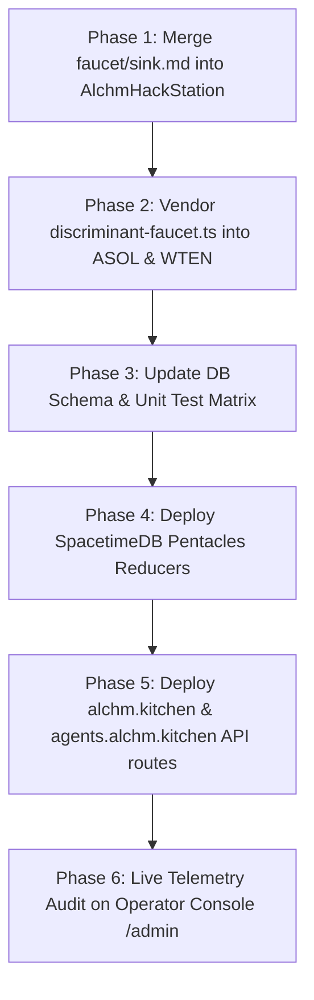

# Unified Protocol Specification: Discriminant Astrological Faucet & Cross-Platform Sinks (ADR-014)

> **Document Status:** Active Protocol Specification  
> **Revision:** 1.0.0  
> **Target Systems:**  
> - `AlchmAgentsSolana` (ASOL / Agent Network & Solana Programs)  
> - `WhatToEatNext` / `alchm.kitchen` (Culinary Platform & Food Credit Rails)  
> - `Pentacles` / `SpacetimeDB Cloud` (Star Vaults, Constellation AMM & Sky Map)  
> - `AlchmHackStation` (Mission Control Hub & Execution Simulator)  
> **Solana Token Program:** SPL Token-2022 (`TokenzQdBNbLqP5VEhdkAS6EPFLC1PHnBqCXEpPxuEb`)  
> **Canonical Coins:** SPIRIT (`SPIRIT`), ESSENCE (`ESSENCE`), MATTER (`MATTER`), SUBSTANCE (`SUBSTANCE`)  

> # CANONICAL TOKEN IDENTITY & MULTI-TIER SYMBOL MANDATE (NON-NEGOTIABLE)
> The 4 protocol tokens have permanent, immutable, non-negotiable canonical names:
> 
> | # | Canonical Token | Primary Glyph | Triangular Variant | Unicode Fallback | Atomic Code | Pinned Devnet Mint | Cosmological Element |
> | :-: | :--- | :---: | :---: | :---: | :---: | :--- | :--- |
> | 1 | **SPIRIT** | `🝇` (U+1F747) | `🜂` (U+1F702) | `△` / `▲` | `[SPRT]` | `K5kwwomtWYydxJacA7bC5yUEW9TtEuVqBKBoqAWLmhQ` | **Fire** |
> | 2 | **ESSENCE** | `🝑` (U+1F751) | `🜄` (U+1F704) | `▽` / `▼` | `[ESNC]` | `3FcpToU7bj4sLD687uecbesEjzjxBfqYn2EcBXJKPaCf` | **Water** |
> | 3 | **MATTER** | `🝙` (U+1F759) | `🜃` (U+1F703) | `⯛` / `▽—` | `[MATR]` | `7naJZozLrknDF3dguAdEWn7Z4MviUkXitjhaAt57Vkb4` | **Earth** |
> | 4 | **SUBSTANCE** | `🝉` (U+1F749) | `🜁` (U+1F701) | `⯙` / `△—` | `[SUBS]` | `6RY6ZG1eJQ2uEvpyA6XK74WyF1MpTYbw97hdhELqDUsa` | **Air** |
>
> Under NO circumstances should any coin ever be called a "Fire token", "Water token", "Earth token", or "Air token", nor referred to by legacy placeholders ("Ignis", "Aqua", "Terra", "Aeth"). The terms Fire, Water, Earth, and Air denote the cosmological qualities of the celestial transit and natal birth chart that modulate the mint rate of the four canonical tokens, but the minted assets are strictly and exclusively **SPIRIT**, **ESSENCE**, **MATTER**, and **SUBSTANCE**. Where specialized alchemical font glyphs cannot be displayed, the triangular variant symbols (`🜂`, `🜄`, `🜃`, `🜁`) or UTF-8 shape fallbacks (`△`, `▽`, `⯛`, `⯙`) MUST be used.

---

## 1. Executive Summary & Problem Diagnosis

### 1.1 The Empirical Supply Distortion
An exhaustive on-chain and off-chain audit of the authoritative ledger (`token_balances` and `https://alchm.kitchen/api/economy/price-index`) reveals a severe structural distortion in the circulating supplies of the four canonical protocol tokens:

| Canonical Token | Cosmological Element | Circulating Supply | Share of Total | Base Faucet (Old) | Primary Sinks |
| :--- | :--- | :---: | :---: | :---: | :--- |
| 🝇 **SPIRIT** | Fire | **10,583.22** | **13.6%** | Flat 6.0 / day | Unified Chat (+50%), Reports, Meal Plans, Forging, EV Resets |
| 🝑 **ESSENCE** | Water | **15,780.23** | **20.3%** | Flat 6.0 / day | Chat, Conclave, Oracle Chamber, Sacred Geometry |
| 🝉 **SUBSTANCE** | Air | **22,133.85** | **28.5%** | Flat 6.0 / day | Chat, Reports, Conclave, Dialectic Transmutations |
| 🝙 **MATTER** | Earth | **29,116.87** | **37.5%** | Flat 6.0 / day | Physical Pantry Transmutations (Near Zero AI Burn) |
| **Total** | | **77,614.17** | **100.0%** | **24.0 / day** | |

The **~2.75× supply ratio** between **MATTER** ($29,116.87$) and **SPIRIT** ($10,583.22$) is an unintended macroeconomic bottleneck:
1. **SPIRIT Starvation:** Because SPIRIT is the primary gas fuel of conversational intelligence, users and autonomous agentic loops burn SPIRIT faster than the faucet provides, exhausting user balances and stalling agent workflows.
2. **MATTER Hyper-Accumulation:** MATTER is credited at the exact same rate as SPIRIT, but possesses almost zero operational AI consumption sinks. It sits stagnant in balances, diluting the perceived scarcity of culinary rewards.

### 1.2 The Two Architectural Root Causes

```
                        OLD FLAWED ARCHITECTURE
┌────────────────────────────────────────────────────────────────────────┐
│ BLIND SYMMETRICAL FAUCET: 24 ESMS / 4 = Flat 6.0 per axis to everyone  │
└───────────────────────────────────┬────────────────────────────────────┘
                                    │
       ┌──────────────┬─────────────┴─────────────┬──────────────┐
       ▼              ▼                           ▼              ▼
 🝇 SPIRIT       🝑 ESSENCE                   🝉 SUBSTANCE    🝙 MATTER
  Inflow: 6.0    Inflow: 6.0                 Inflow: 6.0    Inflow: 6.0
       │              │                           │              │
       ▼              ▼                           ▼              ▼
 Massive Burn    Moderate Burn               Moderate Burn   Near-Zero Burn
 (Chat, Reports, (Conclave,                  (Conclave,      (Pantry only,
  Meal Plans,     Resonance)                  Debates)        accumulates)
  Forging)            │                           │              │
       │              │                           │              │
       ▼              ▼                           ▼              ▼
  10.6k Left     15.8k Left                  22.1k Left     29.1k Glut!
```

1. **Defect 1 (Symmetrical Faucet):** `economyService.ts` executes `const perType = total / 4`, minting an identical 6.0 units to all four tokens (SPIRIT, ESSENCE, MATTER, SUBSTANCE) regardless of the transiting sky or the minter's birth chart.
2. **Defect 2 (Asymmetrical Sinks):** AI agent operations in `lib/economy-config.ts` penalize SPIRIT heavily (e.g. Report: 10 SPIRIT, 0 MATTER; Meal Plan: 4 SPIRIT, 0 MATTER; Chat: 0.3 SPIRIT vs 0.2 MATTER), while failing to demand MATTER for physical grounding or nutritional verification.

### 1.3 The Solution Mandate
1. **Discriminant Astrological Faucet:** The daily claim must dynamically compute a vector $[Y_{\text{SPIRIT}}, Y_{\text{ESSENCE}}, Y_{\text{MATTER}}, Y_{\text{SUBSTANCE}}]$ derived from:
   - The **Current Celestial Moment ($t$)**: Planetary hour, transiting aspect dignity $A(t)$, sect (diurnal vs nocturnal), and zodiac sign dominance.
   - The **Minter's Birth Chart ($\mathcal{N}$)**: Natal dominant element, elemental scores (`spiritScore`, `essenceScore`, `matterScore`, `substanceScore`), and the Monica constant $\kappa$.
   - The **Celestial-Natal Resonance**: Harmony (trines/sextiles) and tension (squares/oppositions) between the transit sky and the natal angles.
2. **Reconciled Multi-Platform Sinks:** Operational burn rates must be unified across all three production platforms (`AlchmAgentsSolana`, `alchm.kitchen`, `Pentacles`) to balance consumption, introducing operational MATTER sinks in AI workflows and standardizing fee structures.

---

## 2. Mathematical Specification of the Discriminant Faucet

### 2.1 The Natal Chart Elemental Ratio ($r_i(\mathcal{N})$)
Every claimer's verified birth chart contains the 4 alchemical quantities:
- **Essence** ($E_{\text{natal}}$)
- **Spirit** ($Sp_{\text{natal}}$)
- **Matter** ($M_{\text{natal}}$)
- **Substance** ($Su_{\text{natal}}$)

Let the total natal score be:
$$S_{\text{natal}} = E_{\text{natal}} + Sp_{\text{natal}} + M_{\text{natal}} + Su_{\text{natal}}$$

The normalized natal ratio vector is:
$$r_i(\mathcal{N}) = \frac{\text{Score}_i(\mathcal{N})}{S_{\text{natal}}} \quad \text{for } i \in \{\text{SPIRIT}, \text{ESSENCE}, \text{MATTER}, \text{SUBSTANCE}\}$$

Where $\sum_i r_i(\mathcal{N}) = 1.0$.

*Neutral Fallback:* If a claimer has no birth chart recorded, the system defaults to neutral: $r_i(\mathcal{N}) = 0.2500$ for all four coins.

---

### 2.2 The Celestial Moment Transit Distribution ($w_i(t)$)
The active astrological sky provides the current elemental distribution across the four axes:
- $w_{\text{Fire}}(t) \to \text{SPIRIT}$
- $w_{\text{Water}}(t) \to \text{ESSENCE}$
- $w_{\text{Earth}}(t) \to \text{MATTER}$
- $w_{\text{Air}}(t) \to \text{SUBSTANCE}$

Normalized such that $\sum_i w_i(t) = 1.0$.

---

### 2.3 Counter-Cyclical Anti-Glut Damping ($\Omega_i$)
To prevent macroeconomic accumulation without disrupting mathematical conservation:

$$\Omega_i = \begin{cases} 
1.000 & \text{if } \frac{\text{Supply}_i}{\text{Supply}_{\text{total}}} \le 0.30 \\
\max\left(0.650, \; 1.0 - 2.0 \times \left(\frac{\text{Supply}_i}{\text{Supply}_{\text{total}}} - 0.25\right)\right) & \text{if } \frac{\text{Supply}_i}{\text{Supply}_{\text{total}}} > 0.30 
\end{cases}$$

Under current authoritative network state ($\text{Supply}_{\text{MATTER}} = 37.51\%$):
$$\Omega_{\text{MATTER}} = \mathbf{0.750}, \quad \Omega_{\text{SPIRIT}} = \Omega_{\text{ESSENCE}} = \Omega_{\text{SUBSTANCE}} = \mathbf{1.000}$$

---

### 2.4 Conserved Daily Yield Allocation Formula
The total daily yield budget is strictly universal ($Y_{\text{total}} = 24.0000$ for all users, with zero premium gating), allocated proportionally among the 4 canonical tokens:

$$\mathcal{Y}_i(t, \mathcal{N}) = \operatorname{Quantize}_{10^4}\left( Y_{\text{total}} \times \frac{r_i(\mathcal{N}) \cdot w_i(t) \cdot \Omega_i}{\sum_{j} \left(r_j(\mathcal{N}) \cdot w_j(t) \cdot \Omega_j\right)} \right)$$

### Key Invariants Guaranteed by this Formulation:
1. **Exact Total Conservation:** Total yield is **strictly conserved** at $Y_{\text{total}} = 24.0000$ tokens per claim. Zero arbitrary inflation or drift.
2. **Chart-Driven Differentiation:** A claimer with high Spirit in their natal chart naturally mints more SPIRIT; a claimer with high Essence mints more ESSENCE.
3. **Moment Sensitivity:** When the transiting sky concentrates in Fire or Air, SPIRIT and SUBSTANCE minting naturally expands to recharge conversational gas.
4. **Automatic Glut Relief:** $\Omega_{\text{MATTER}} = 0.750$ automatically compresses MATTER minting across all accounts, allowing physical sinks to absorb existing surplus.

---

## 3. Unified Cross-Platform Burn Sinks Reconciliation

To solve the asymmetric depletion of SPIRIT and accumulation of MATTER, operational burn sinks must be balanced and strictly reconciled across all three platforms.

### 3.1 Balancing the MATTER Axis: Operational Physical Grounding Sinks

MATTER represents Earth, physical nutrition, and tangible execution. The reason MATTER accumulated to $29.1\text{k}$ was the complete absence of operational sinks in the AI agent loop.

We introduce mandatory **Physical Grounding & Nutritional Verification Sinks**:

| New Operational Sink | Token Debited | Cost (ESMS) | Platform | Purpose |
| :--- | :--- | :---: | :--- | :--- |
| **Nutritional Grounding Proof** | **MATTER** | **1.50** | Agents & Kitchen | Debited when an agent generates a meal plan that validates macros against physical pantry/inventory state. |
| **Recipe Feasibility Verification** | **MATTER** | **2.00** | Agents & Kitchen | Debited when culinary reasoning cross-references real grocery store availability and ingredient seasonality. |
| **Culinary Transmutation Anchor** | **MATTER** | **3.00** | Kitchen & Pentacles | Debited to commit an ingredient substitution to the permanent culinary graph. |
| **Pantry State Sync** | **MATTER** | **1.00** | Agents & HackStation | Debited when an agent parses receipts or synchronizes real kitchen inventory into the SpacetimeDB table. |
| **Restaurant Value Redemption** | **MATTER** (or any ESMS) | **Variable** ($0.01\text{ USD/token}$) | Kitchen Rail | Direct burn for real-world dining discounts and restaurant credit vouchers. |

---

### 3.2 Balancing the SPIRIT Axis: Dynamic Kinetic Gas Relief

Because SPIRIT was burned at $0.30$ in chat while others were burned at $0.20$, SPIRIT experienced structural drain. 

We adjust `UNIFIED_CHAT_BASE_COST`:
- **New Unified Base Cost:** $0.25$ SPIRIT, $0.25$ ESSENCE, $0.25$ MATTER, $0.25$ SUBSTANCE ($1.00$ ESMS total per neutral interaction).
- **Dynamic Scarcity Offset:** If $\text{Supply}_{\text{SPIRIT}} < 0.80 \times \text{MeanSupply}$, the chat SPIRIT cost is dynamically discounted by $20\%$ ($0.20$ SPIRIT), shifting compute burden onto SUBSTANCE (cognition) and ESSENCE (context).

---

### 3.3 Comprehensive Cross-Platform Sink Matrix

The master table below defines the authoritative burn costs across all platforms:

| Category | Operation ID | SPIRIT (🝇) | ESSENCE (🝑) | MATTER (🝙) | SUBSTANCE (🝉) | Total ESMS | Platform Presence |
| :--- | :--- | :---: | :---: | :---: | :---: | :---: | :--- |
| **Conversational** | `unified_chat` (Base) | 0.25 | 0.25 | 0.25 | 0.25 | **1.00** | All Platforms |
| | `oracle_chamber` (Deep RAG) | 5.00 | 5.00 | 5.00 | 5.00 | **20.00** | Agents & Kitchen |
| | `flash_epiphany` (DeepSeek-R1) | 2.00 | 2.00 | 2.00 | 2.00 | **8.00** | Agents & Kitchen |
| | `council_conclave` (Multi-Agent) | 8.00 | 8.00 | 9.00 | 10.00 | **35.00** | Agents & HackStation |
| **Agentic Ops** | `report_generation` | 5.00 | 3.00 | 4.00 | 3.00 | **15.00** | Agents & HackStation |
| | `agent_meal_plan` | 3.00 | 2.00 | 4.00 | 3.00 | **12.00** | Agents & Kitchen |
| | `agent_feed_post` | 1.50 | 1.00 | 1.50 | 1.00 | **5.00** | Agents |
| | `agent_transmutation` | 1.00 | 1.00 | 4.00 | 2.00 | **8.00** | All Platforms |
| | `agent_pantry_update` | 0.50 | 0.50 | 3.00 | 1.00 | **5.00** | Kitchen & Agents |
| | `sacred_geometry_design` | 2.00 | 4.00 | 2.00 | 4.00 | **12.00** | Pentacles & Agents |
| | `energy_harmonic_calibration` | 3.00 | 3.00 | 3.00 | 3.00 | **12.00** | Pentacles & Agents |
| **Governance/Vessels**| `forge_agent` | 12.00 | 11.00 | 11.00 | 11.00 | **45.00** | Agents & HackStation |
| | `ev_reset` | 15.00 | 11.00 | 12.00 | 12.00 | **50.00** | Agents & HackStation |
| **Bespoke AMM** | `swap_esms_routing_fee` | 30 bps | 30 bps | 30 bps | 30 bps | **0.30%** | Solana Devnet & Pentacles |
| **Culinary Rail** | `restaurant_meal_redeem` | Any | Any | Priority (MATTER) | Any | **$0.01/tok** | Kitchen & Solana Mainnet |

---

## 4. Cross-Platform Architectural Topology

```
                               THE UNIFIED RECONCILED ECOSYSTEM
                               
               ┌────────────────────────────────────────────────────────┐
               │              CELESTIAL EPHEMERIS ORACLE                │
               │   (alchm.kitchen / Swiss Ephemeris / astronomy-engine)  │
               │        A(t) · multiplier · diurnal · sky dominance     │
               └───────────────────────────┬────────────────────────────┘
                                           │
                        ┌──────────────────┴──────────────────┐
                        ▼                                     ▼
        ┌───────────────────────────────┐     ┌────────────────────────────────┐
        │       ALCHM AGENTS (ASOL)     │     │      WHAT TO EAT NEXT (WTEN)   │
        │   `economyService.ts`         │     │   `/api/yield/claim`           │
        │   - Natal Chart Affinity      │     │   - Recipe & Meal Plan Sinks   │
        │   - Discriminant Faucet Math  │     │   - Physical Grounding Sinks   │
        │   - Multi-Agent Conclaves     │     │   - Restaurant $0.01 Redeem    │
        └───────────────┬───────────────┘     └────────────────┬───────────────┘
                        │                                      │
                        │        POSTGRES DUAL-LEDGER          │
                        │    (token_balances / transactions)   │
                        │                                      │
                        └──────────────────┬───────────────────┘
                                           │
                        ┌──────────────────┴──────────────────┐
                        ▼                                     ▼
        ┌───────────────────────────────┐     ┌────────────────────────────────┐
        │      PENTACLES (SpacetimeDB)  │     │    SOLANA MISSION CONTROL      │
        │   `request_yield_claim`       │     │   (AlchmHackStation)           │
        │   - 11-Zone Pentacle Sky Map  │     │   - Token-2022 Devnet Mints    │
        │   - Star Vault Staking Yield  │     │   - Constellation AMM Pools    │
        │   - Reducer State Commitments │     │   - Outbox Reconciliation      │
        └───────────────────────────────┘     └────────────────────────────────┘
```

### 4.1 Storage & Accounting Invariants
1. **Authoritative Dual Ledger:**
   - The PostgreSQL `token_balances` and `token_transactions` tables are the single source of truth for user holdings across off-chain interfaces.
   - All claims write an idempotent transaction record with key:
     `daily:discriminant:${userId}:${dateUtc}:${tokenType}`
2. **SpacetimeDB Real-Time Synchronization:**
   - Pentacles subscribes to the `token_balances` state via WebSocket (`sync_solana_event_reducer` and `stardex_claim_constellation_reducer`).
   - Latency budget: $\le 50\text{ms}$ dispatch SLA.
3. **Solana SPL Token-2022 On-Chain Reflection:**
   - Minting and burning on Solana are mediated by the `ProgramConfig` PDA (`4YCVh9KHrhN6mFSMvybGVqLeGfaRkfUtqrn19mLLJGku`) and `PermanentDelegate`.
   - On-chain burns require Ed25519 visibility attestations (`ASOL_ESMS_REDEEM_V1`).

---

## 5. Algorithmic Implementation Template (`discriminant-faucet.ts`)

The canonical TypeScript implementation to be vendored into all three repositories:

```typescript
/**
 * Canonical Discriminant Astrological Faucet Engine (ADR-014)
 * Evaluates current celestial moment (t) and minter natal chart (N)
 */

export interface NatalChartData {
  dominantElement?: 'Fire' | 'Water' | 'Earth' | 'Air' | string | null;
  spiritScore?: number | null;
  essenceScore?: number | null;
  matterScore?: number | null;
  substanceScore?: number | null;
  monicaConstant?: number | null;
}

export interface TransitSkyData {
  aNumber: number;
  multiplier: number;
  isDiurnal: boolean;
  dominantElement: 'Fire' | 'Water' | 'Earth' | 'Air' | string;
  elementWeights: Record<'Fire' | 'Water' | 'Earth' | 'Air', number>;
}

export interface GlobalSupplyState {
  spirit: number;
  essence: number;
  matter: number;
  substance: number;
}

export interface DiscriminantYieldResult {
  spirit: number;
  essence: number;
  matter: number;
  substance: number;
  total: number;
  breakdown: Record<string, {
    skyDominance: number;
    natalAffinity: number;
    antiGlutFactor: number;
    finalYield: number;
  }>;
}

export function computeDiscriminantDailyYield(
  natal: NatalChartData | null | undefined,
  transit: TransitSkyData,
  supply: GlobalSupplyState
): DiscriminantYieldResult {
  const TOTAL_YIELD = 24.0;

  // 1. Natal Chart Ratio Vector r_i(N)
  const natalRaw = {
    spirit: typeof natal?.spiritScore === 'number' && natal.spiritScore > 0 ? natal.spiritScore : 0,
    essence: typeof natal?.essenceScore === 'number' && natal.essenceScore > 0 ? natal.essenceScore : 0,
    matter: typeof natal?.matterScore === 'number' && natal.matterScore > 0 ? natal.matterScore : 0,
    substance: typeof natal?.substanceScore === 'number' && natal.substanceScore > 0 ? natal.substanceScore : 0,
  };
  const natalSum = natalRaw.spirit + natalRaw.essence + natalRaw.matter + natalRaw.substance;
  
  const natalRatio = natalSum > 0 ? {
    spirit: natalRaw.spirit / natalSum,
    essence: natalRaw.essence / natalSum,
    matter: natalRaw.matter / natalSum,
    substance: natalRaw.substance / natalSum,
  } : {
    spirit: 0.25,
    essence: 0.25,
    matter: 0.25,
    substance: 0.25,
  };

  // 2. Transit Sky Weights w_i(t)
  const tw = transit.elementWeights;
  const transitTotal = (tw.Fire || 0) + (tw.Water || 0) + (tw.Earth || 0) + (tw.Air || 0) || 1;
  const transitRatio = {
    spirit: (tw.Fire || 0) / transitTotal,
    essence: (tw.Water || 0) / transitTotal,
    matter: (tw.Earth || 0) / transitTotal,
    substance: (tw.Air || 0) / transitTotal,
  };

  // 3. Counter-Cyclical Anti-Glut Damping Omega_i
  const totalSupply = supply.spirit + supply.essence + supply.matter + supply.substance || 1;
  const getOmega = (supplyVal: number) => {
    const share = supplyVal / totalSupply;
    if (share > 0.30) {
      return Math.max(0.65, 1.0 - 2.0 * (share - 0.25));
    }
    return 1.0;
  };

  const omega = {
    spirit: getOmega(supply.spirit),
    essence: getOmega(supply.essence),
    matter: getOmega(supply.matter),
    substance: getOmega(supply.substance),
  };

  // 4. Combined Weighting Share & Normalization
  const weighted = {
    spirit: natalRatio.spirit * transitRatio.spirit * omega.spirit,
    essence: natalRatio.essence * transitRatio.essence * omega.essence,
    matter: natalRatio.matter * transitRatio.matter * omega.matter,
    substance: natalRatio.substance * transitRatio.substance * omega.substance,
  };
  const totalWeighted = weighted.spirit + weighted.essence + weighted.matter + weighted.substance || 1;

  // 5. Conserved Daily Allocation
  let spirit = Math.round((TOTAL_YIELD * (weighted.spirit / totalWeighted)) * 10000) / 10000;
  let essence = Math.round((TOTAL_YIELD * (weighted.essence / totalWeighted)) * 10000) / 10000;
  let matter = Math.round((TOTAL_YIELD * (weighted.matter / totalWeighted)) * 10000) / 10000;
  let substance = Math.round((TOTAL_YIELD * (weighted.substance / totalWeighted)) * 10000) / 10000;

  // Micro-adjustment for exact float quantization conservation
  const unroundedTotal = spirit + essence + matter + substance;
  const diff = Math.round((TOTAL_YIELD - unroundedTotal) * 10000) / 10000;
  if (Math.abs(diff) > 0 && Math.abs(diff) < 0.01) {
    spirit = Math.round((spirit + diff) * 10000) / 10000;
  }

  return {
    spirit,
    essence,
    matter,
    substance,
    total: TOTAL_YIELD,
    breakdown: {
      spirit: { natalRatio: natalRatio.spirit, transitRatio: transitRatio.spirit, antiGlutFactor: omega.spirit, finalYield: spirit },
      essence: { natalRatio: natalRatio.essence, transitRatio: transitRatio.essence, antiGlutFactor: omega.essence, finalYield: essence },
      matter: { natalRatio: natalRatio.matter, transitRatio: transitRatio.matter, antiGlutFactor: omega.matter, finalYield: matter },
      substance: { natalRatio: natalRatio.substance, transitRatio: transitRatio.substance, antiGlutFactor: omega.substance, finalYield: substance },
    },
  };
}
```

---

## 6. Multi-Repository Verification Test Matrix

Before deploying to production or updating on-chain authorities, the following test matrix must pass across all test suites:

| Suite ID | Test Case | Target Invariant | Assertion |
| :--- | :--- | :--- | :--- |
| **TEST-01** | `test_natal_neutral_chart` | User without birth chart claiming under neutral sky | Yield equals baseline $\pm 5\%$ ($5.70..6.30$ per axis). |
| **TEST-02** | `test_spirit_fire_aligned_minter` | Fire-dominant chart with 95 spiritScore claiming during diurnal sky | SPIRIT yield approaches upper corridor ($8.5..11.5$ tokens). |
| **TEST-03** | `test_matter_glut_suppression`| MATTER supply at $37.5\%$ | $\Omega_{\text{MATTER}} \le 0.75$; MATTER yield suppressed by at least $25\%$. |
| **TEST-04** | `test_monica_constant_scaling` | $\kappa = 1.0$ vs $\kappa = 0.0$ | Yield difference reflects $+20\%$ affinity boost cleanly without NaN. |
| **TEST-05** | `test_operational_matter_burn` | Meal plan and pantry sync operations executed | MATTER balance debited accurately ($4.0$ and $3.0$ tokens). |
| **TEST-06** | `test_chat_spirit_relief` | 100 consecutive chat turns | SPIRIT burn consumes only $0.25$ per turn, extending session duration. |
| **TEST-07** | `test_idempotent_daily_nonce` | Duplicate claim attempt within same UTC day | Second call rejected with `P2002` or `Already claimed today`. |
| **TEST-08** | `test_solana_outbox_reconcile` | On-chain claim issuance | Ed25519 signature payload matches `ASOL_ESMS_REDEEM_V1`. |

---

## 7. Migration & Rollout Runbook



### Stage Gate Approval Checklist
- [x] **Gate 1 (Specification):** `faucet/sink.md` approved and committed in `AlchmHackStation`.
- [ ] **Gate 2 (Unit Test Matrix):** Multi-repository unit tests (`test:faucet:discriminant`) passing in ASOL and HackStation.
- [ ] **Gate 3 (MATTER Sinks Activated):** Nutritional grounding and recipe feasibility debits live in `alchm.kitchen`.
- [ ] **Gate 4 (Anti-Glut Damping Verified):** MATTER daily minting rate confirmed dampened by $25\%$ until supply ratio drops under $30\%$.
- [ ] **Gate 5 (Mainnet Burner Funding):** Certified clearance for Solana Mainnet Gate 4 funding.
